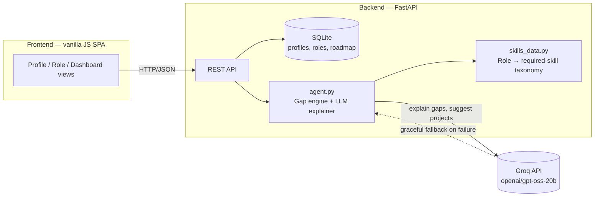

# SkillPath — AI Skill-Gap & Personalized Learning Agent

**Bit N Build '26 — UP Regionals — Problem Statement 05 (Education & Employability)**

> Students often know the role they want but don't know which skills they lack,
> what projects demonstrate those skills, or how to prioritize learning.
> SkillPath converts a student's current profile into a measurable, adaptive
> roadmap toward a target role.

---

## 1. What it does

1. **Profile intake** — student enters current skills (self-rated 1–5) and any
   projects they've already built.
2. **Target role selection** — pick from a role taxonomy or type a custom
   title; optionally paste a real job description.
3. **Gap analysis** — deterministic, importance-weighted comparison of the
   student's skills against what the role actually requires, sorted by
   severity so the highest-leverage gaps surface first.
4. **AI-explained, prioritized roadmap** — a Groq-hosted model (`openai/gpt-oss-20b`)
   turns the raw gap scores into plain-language reasoning and *specific*
   project suggestions (reusing the student's existing projects where
   possible instead of always proposing something new).
5. **Progress tracking** — student marks roadmap items *not started / in
   progress / done*; a recompute re-ranks the roadmap without discarding
   progress already made.

## 2. Why it fits the brief

| Requirement | How SkillPath addresses it |
|---|---|
| AI reasoning | Groq's `openai/gpt-oss-20b` generates grounded, personalized explanations and project ideas — never invents the underlying gap scores, which are computed deterministically first. |
| Real-world data/APIs | `skills_data.py` is a pluggable market-intelligence layer (currently a curated taxonomy — see §5 for the real-API swap-in). |
| Persistent state | SQLite stores profile, target role, and per-skill roadmap status across sessions. |
| Explainability | Every gap and every roadmap item carries a `reason` string grounded in concrete numbers (market weight, level delta) — no unexplained scores. |
| Human-in-the-loop | The agent only *recommends*. It never auto-enrolls, auto-submits, or silently reprioritizes; the student explicitly triggers recompute and marks their own progress. |
| Graceful failure handling | If `GROQ_API_KEY` is missing or the API call/parse fails, the system falls back to deterministic, rule-based explanations automatically — the product never breaks or shows a blank state (see `agent.py`). |

## 3. Architecture



**Pipeline inside `agent.py`:**

```
current_skills + target_role
        │
        ▼
compute_gap()            ── deterministic, always runs
   → severity = (target_level - current_level) × market_weight
        │
        ▼
explain_gaps_with_llm()  ── Groq model adds explanation + project idea
   → on ANY failure (no key / network / bad JSON) → deterministic fallback text
        │
        ▼
build_roadmap()          ── sorted by severity, pure function
        │
        ▼
persisted to SQLite, status preserved across recomputes
```

## 4. Tech stack

- **Backend:** Python, FastAPI, SQLite, OpenAI Python SDK (pointed at Groq's OpenAI-compatible endpoint)
- **Frontend:** Vanilla HTML/CSS/JS (no build step — runs by opening a file / any static server)
- **AI:** GroqCloud (`openai/gpt-oss-20b`, via the Responses API) for natural-language explanation and project-suggestion generation

## 5. Setup

### Backend
```bash
cd backend
python -m venv venv && source venv/bin/activate   # Windows: venv\Scripts\activate
pip install -r requirements.txt
cp .env.example .env   # add your GROQ_API_KEY, or leave unset to use fallback mode
export $(cat .env | xargs)   # or use python-dotenv / your shell's env loading
uvicorn main:app --reload --port 8000
```

> ⚠️ **Key hygiene:** never commit a real `.env` file — `.gitignore` at the
> repo root already excludes it. If a Groq key has ever been pasted into a
> chat, doc, or committed by mistake, rotate it at
> [console.groq.com/keys](https://console.groq.com/keys) before the demo.

### Frontend
```bash
cd frontend
python -m http.server 5500
# open http://localhost:5500
```
The frontend calls `API_BASE = "http://localhost:8000"` (see top of `app.js`) — change this if you deploy the backend elsewhere.

### Swapping in real market data (stretch goal)
Replace the static dict in `skills_data.get_role_skills()` with a call to a
job-postings API (e.g. aggregate skill frequency from live listings) and
compute `weight` as the fraction of postings mentioning each skill. The rest
of the pipeline (`agent.py`) does not need to change — it only depends on
the `{skill: {weight, min_level}}` shape.

## 6. Repository structure

```
skillgap-agent/
├── backend/
│   ├── main.py           # FastAPI routes
│   ├── agent.py          # gap analysis + LLM explanation + roadmap builder
│   ├── skills_data.py     # role → required-skills taxonomy (mock market intel)
│   ├── db.py              # SQLite persistence
│   ├── requirements.txt
│   └── .env.example
├── frontend/
│   ├── index.html
│   ├── style.css
│   └── app.js
└── README.md
```

## 7. Demo script (for the video)

1. Fill in a profile with 3–4 skills at varying levels + one project.
2. Pick "Frontend Developer" as the target role.
3. Show the gap list — point out the severity ordering and the AI-generated
   explanation referencing market weight.
4. Show the roadmap with a project suggestion that reuses the student's
   existing project.
5. Mark one item "done", hit **Recompute**, show progress % update and that
   the completed item's status survives the recompute.
6. (Optional, to show graceful failure) unset `GROQ_API_KEY`, restart
   the backend, re-run analysis — show the "Rule-based fallback" badge and
   that explanations still render correctly.

## 8. Judging-criteria self-check

- **Innovation:** severity-ranked, importance-weighted gap scoring instead of a flat skill checklist; project suggestions that reuse the student's own portfolio.
- **Technical implementation:** clean separation between deterministic scoring (trustworthy, auditable) and LLM-generated explanation (natural language, replaceable, fails safe).
- **Problem relevance:** directly targets the stated gap — students not knowing *what* to learn, *why*, or *in what order*.
- **Impact & practicality:** works fully offline via fallback mode; taxonomy is swappable for live job-market data without touching the reasoning engine.
- **UX:** three-step flow (profile → role → dashboard), visible progress bar, plain-language reasons instead of raw scores.
